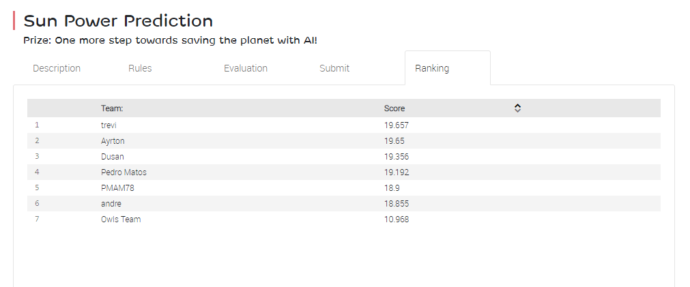

```{r , include= FALSE}
knitr::opts_chunk$set(echo = TRUE)
```

```{r , warning= FALSE, message= FALSE}

library(knitr)
library(tidyverse)
library(kableExtra)

```

# Introducción {-}

En este notebook estoy incluyendo el proceso de creación de los modelos con los que intentaré colarme en el ranking de participantes del Challenge de machine learning "Sun Power Prediction" que EDP tiene colgado en su [web de open data](https://opendata.edp.com/pages/challenges/#ranking) y que incluyo a continuación (Fecha: 2019-11-14).

"The objective of this competition is to build an algorithm that predicts the production of solar module B (with optimal orientation) for the first seven days of 2018. For this, you can rely on the weather station data for these days."

```{r , echo= FALSE, out.width = "600px"}

```


  Hasta ahora sólo hay 7 participantes, no estoy seguro si hay un score de corte o no, como tienen establecido en otros challenges. El score lo calculan multiplicando el R cuadrado obtenido por 20. Así que ahora mismo las predicciones enviadas han conseguido los siguientes resultados en términos de R cuadrado.
  
```{r , warning= FALSE, message=FALSE}
ranking <- read_delim("data/ranking_partipants.csv", delim = ";")

ranking <- ranking %>% mutate(R2 = Score/20)

ranking %>% kable %>% 
            kable_styling()

```

Mi primer objetivo es entrar simplemente en el listado. Así que para intentar asegurar esto tendré que conseguir un R cuadrado superior al conseguido por el "Owls Team". Lo de conseguir ir más arriba en el ranking de momento no lo veo muy plausible. El resto de R cuadrados los veo realmente muy, muy altos.
